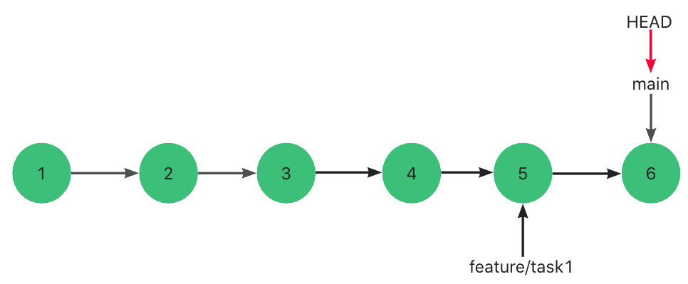
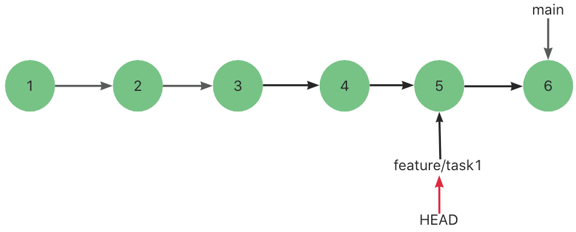
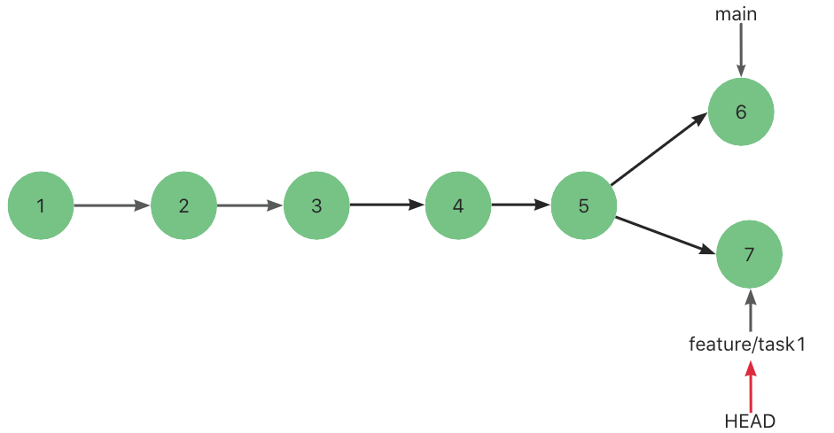
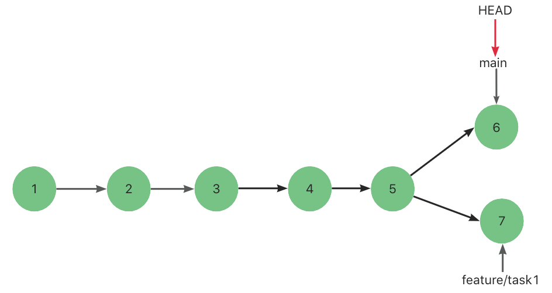
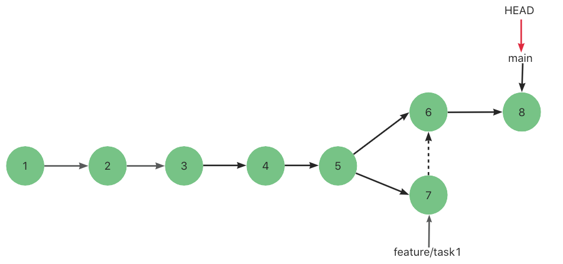

🔥 git revert 撤销 merge  之后再次 merge 我的代码消失了？

前段时间需求功能开发完成之后，将```需求分支feature/task1```合到主分支。

后来因为增加需求导致项目延期，为了不影响到主分支，就使用 git revert 进行合并撤销。

然后继续在 ```feature/task1``` 上进行开发，再次进行 merge request。

当成功 merge后，发现自己的部分代码“消失“了。

> 可怕得不是有冲突，而是这种“悄无声息“的消息，没有一点痕迹。

百思不得其解，所以就调研下 merge 相关的知识。

# 一、分支指针 & HEAD指针

众所周知，git最牛逼的地方就是它追踪并管理的是修改，而不是文件。

每提交一个新版本，git就会将这些提交串联成一个时间线。

我们将每次的提交称作是commit。（如下代表这里有 3 个提交）


而分支```本质上仅仅是指向commit的可变指针```。

git 的默认分支指针名字是 main。

在多次提交操作之后，你其实已经有一个指向最后那个提交对象的 main 指针。

main分支指针会在每次提交时自动向前移动。


```HEAD指针严格来说不是指向提交，而是指向分支指针，分支指针才是指向提交的。``` 

上图中，git用 main分支指针指向最新的提交，再用 HEAD指向 main，就能确定当前分支，以及当前分支的提交点。

# 二、复现“文件消失“步骤

## 2.1 第一次合并

利用指针的思路使用```git checkout -b feature/task1```创建并切换分支来开发需求。


此时，创建了一个分支指针 feature/task1 并指向提交3，HEAD指针指向该分支指针。 

然后在 feature/task1 分支上进行 4 提交和 5 提交，指针随着提交向后移动。

> 其中在第五次提交中我们新增文件 5.txt。


此时 feature/task1 指针指向提交 5，HEAD指针指向了 feature/task1 指针。

此时需求开发完毕，我们进行第一次合并。

我们执行```git checkout main```切换到 main分支上。


然后执行```git merge feature/task1``` 准备将提交 4 和提交 5 合并进 main分支 中。

```由于 feature/task1 所指向的提交 5 是 main的直接后继，因此 git 会直接将 HEAD指针向前移动```。

> 换句话说，如果顺着一个分支走下去一定能够到达另一个分支，那么 Git 在合并两者时只会简单的将指针向前推进（右移），因为这种情况下的合并操作没有需要解决的分歧——这就叫做快进（fast-forward）。

此时，合并成功。分支如图所示。


## 2.2 撤销合并 

在我们使用 Git的操作中，遇到需要回滚代码的情况几乎是难以避免的。

```“git revert <commit id>”```命令用于“反做”某一个提交，以达到撤销该提交的目的。


> 什么是“反做”？
>
> 比如在一次提交中添加了某个文件，那么```“反做”```就是在下次提交中删除某个文件，达到撤销的目的。
>
> 比如，我们提交了三次，突然发现第二次提交不行，想要撤销第二次提交。但是不想撤销第三次提交，就可以用git revert命令来反做第二次提交，同时生成新的提交，也就是第四次提交。在第四次提交中撤销了版本二的东西。
> 
> 但是注意：第二次提交是不会删除的。

我们使用 git revert 来撤销第五次提交。 

下图中会生成一个新的提交 6，里面的内容是执行提交 5 的相反操作。

> 此时在这个新的提交中，删除了文件 5.txt。

提交 5 也不会被删除，依旧存在在这条时间线上。



## 2.3 继续编写需求 然后进行再次合并

我们将分支再次切回到 feature/task1 继续开发需求。



然后新增第 7 次提交。



需求开发完毕，需要再次合并。

先切回 main分支。



执行命令```git merge feature/task1```进行合并feature/task1的代码。

> 此时提交 7 并不是提交 6 的后继节点。
>
> 所以git merge采用的不是快进合并策略（main指针直接右移），而是三路合并策略。
>
> 三路合并策略会产生一个新的 commit，这叫做提交 8。



合并完成以后，会发现``` 5.txt文件消失了```，但是这个文件其实是在 feature/task1 分支中开发的新功能，是需要保留的。

# 三、“文件消失”原因

因为第五次提交已经在 main分支上了 （虽然被 revert，但仍在）。

所以 git 会拒绝合进重复的 commit。

# 四、解决方案

## 4.1 暴力解决

找到之前被 revert的 commit ，然后手动对比进行修改提交。

## 4.2 再次 revert

对 revert 的那次提交记录再次进行 revert。

我们知道 revert 是反做。

比如在一个提交A中我们删除了文件 index.js。

然后 git revert这个提交以后，就生成了一个新的提交B，内容是新增了文件 index.js。

那么我们可以再次 git revert 提交 B，就生成了一个新的提交 C，内容是删除了文件 index.js。


 
