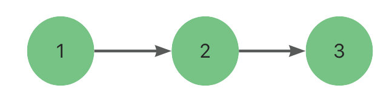
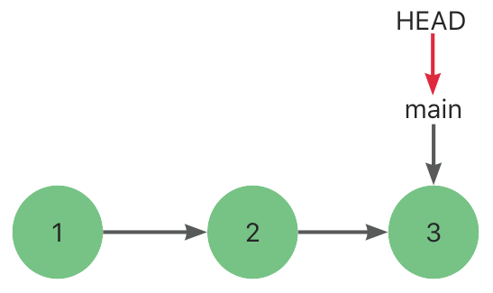
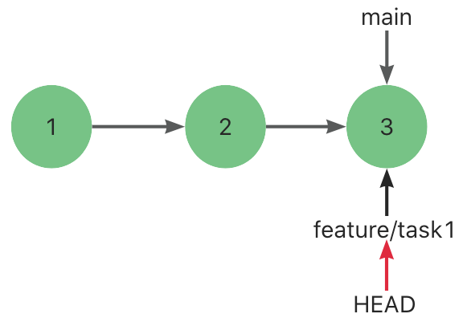
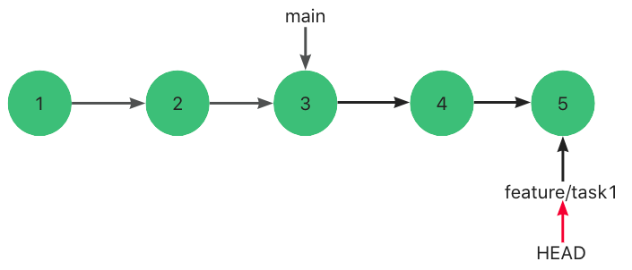
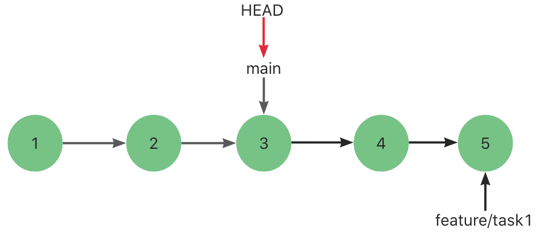
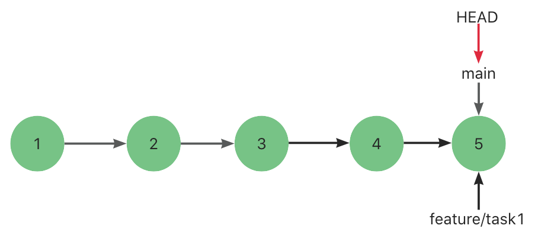

🔥 git revert 撤销 merge request 之后再次 merge 我的代码消失了？

前段时间需求功能开发完成之后，将需求分支合到主分支。

后来项目延期，为了不影响到主分支，就使用 git revert 进行合并撤销。

当需要合并时，再次进行 merge request，当成功 merge后，发现自己的部分代码“消失“了。

可怕得不是有冲突，而是这种“悄无声息“的消息，没有一点痕迹。

百思不得其解，所以就调研下 merge 相关的知识。

# 一、分支指针 & HEAD指针

众所周知，git最牛逼的地方就是它追踪并管理的是修改，而不是文件。

每提交一个新版本，git就会将这些提交串联成一个时间线。

我们将每次的提交称作是commit。（如下代表这里有 3 个提交）



而分支```本质上仅仅是指向commit的可变指针```。

git 的默认分支指针名字是 main。

在多次提交操作之后，你其实已经有一个指向最后那个提交对象的 main 指针。

main分支指针会在每次提交时自动向前移动。

```HEAD指针严格来说不是指向提交，而是指向分支指针，分支指针才是指向提交的。```



上图中，git用 main分支指针指向最新的提交，再用 HEAD指向 main，就能确定当前分支，以及当前分支的提交点，

# 二、复现步骤一：第一次合并

利用指针的思路使用```git checkout -b feature/task1```创建并切换分支来开发需求。



此时，创建了一个分支指针feature/task1，然后将 HEAD指针指向该分支指针。

从而确定了此时的最新分支```feature/task1```和最新提交```3```。

然后进行 4 提交和 5 提交。



此时 feature/task1 指针指向最新提交 5。HEAD指针指向了 feature/task1指针。

此时需求开发完毕，我们进行第一次合并。

我们执行```git checkout main``切换到 main分支上。



然后执行```git merge feature/task1``` 准备将提交 4 和提交 5 合并进 main分支 中。

由于 feature/task1 所指向的提交 5 是 main的直接后继，因此 git 会直接将 HEAD指针向前移动。

换句话说，如果顺着一个分支走下去一定能够到达另一个分支，那么 Git 在合并两者时只会简单的将指针向前推进（右移），因为这种情况下的合并操作没有需要解决的分歧——这就叫做快进（fast-forward）。



此时，分支如图所示。